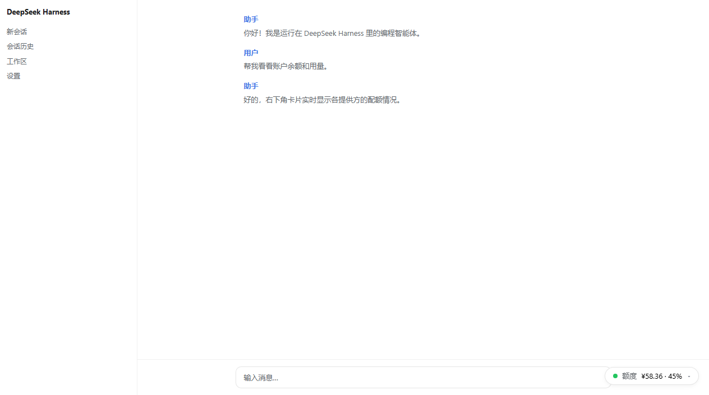
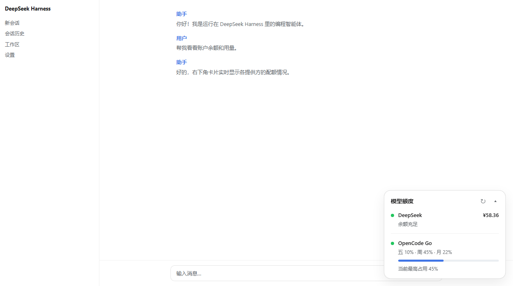
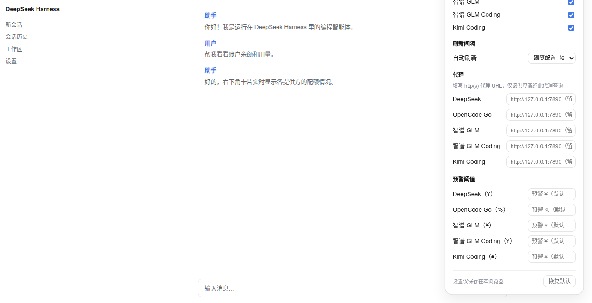
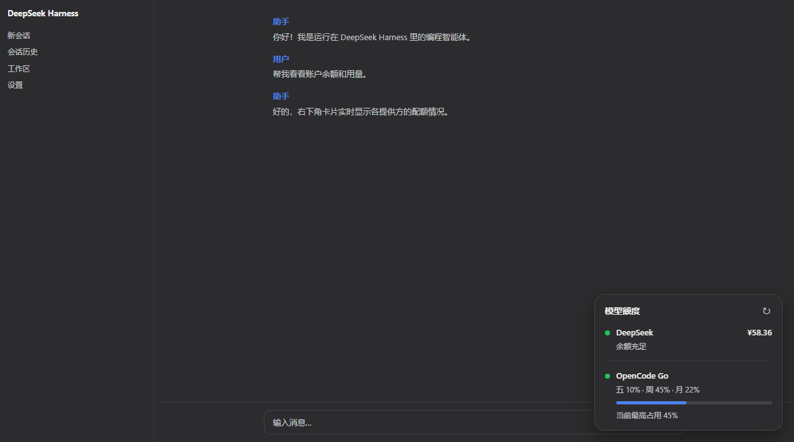
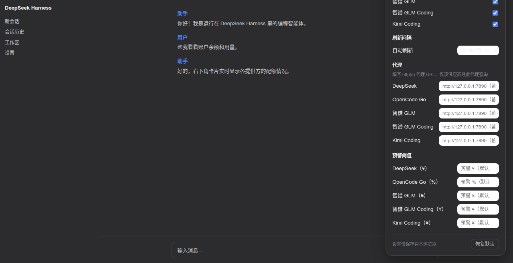

# dsh-quota-panel

English | [中文](README.zh.md)

**dsh-quota-panel** is a **provider quota / balance status widget** for the
DeepSeek Harness (DSH) **web surface** (`dsh web`). It sits in the
bottom-right corner of the product UI, watches every AI provider whose API
key you have configured, and tells you at a glance how much balance /
quota is left — DeepSeek, OpenRouter, SiliconFlow, Moonshot, StepFun,
xAI, Zhipu GLM, OpenCode Go, plus one-api / new-api style aggregators,
and the **coding plans** (智谱 GLM Coding, Z.AI, Kimi Coding, MiniMax
Coding global/CN) with 5-hour / weekly usage windows and MCP monthly quota.

Since v0.5 it is a **dual-face plugin** with a **built-in provider catalog
and auto discovery**: install it, restart `dsh web`, and every provider
whose key resolves automatically appears on the panel — zero configuration.
It needs **no npm dependencies** and asks for **no `allowBuilds` authorization**.

## Screenshots (real browser rendering)

Collapsed capsule, light theme:



Expanded card, light theme:



Settings panel (⚙), light theme:



Collapsed capsule, dark theme:



Expanded card, dark theme:


Settings panel (⚙), dark theme:



## Supported features

- **Auto discovery** — the host half ships a catalog of well-known
  providers; each entry names the provider's standard credential
  references, and **every provider whose key resolves
  (`$DSH_HOME/.credentials.yaml` / `.env` / environment variables)
  appears on the panel automatically**, with zero config. Remove the key
  and the row disappears. No credential enumeration API exists in DSH, so
  the catalog is probed each refresh cycle.
- **Coding-plan usage windows** — GLM / Z.AI / Kimi / MiniMax coding
  plans render as usage rows: 5-hour window, weekly pool and (GLM/Z.AI)
  the MCP monthly lane, each with its own reset countdown; windows the
  plan does not carry show `—` instead of a fabricated 0%.
- **Two sizes** — collapsed: a minimal capsule with one independent
  "status dot + value" pair per account (`● ¥58.36 · ● 45%`); expanded: a
  full card with a row per provider (status dot, name, primary value,
  secondary info, progress bar for usage-kind providers).
- **Auto refresh** — follows the configured interval (default 60 s), paused
  while the page is hidden; the refresh button spins during a fetch and
  repeated clicks never fire concurrent requests.
- **Per-account status** — balance rows are graded by tier
  (`critical <= warn <= healthy`), usage rows by percent
  (`error >= warn`); the offending dot/value alone recolors, others stay
  calm. Usage percentages use battery-style three-color grading, independent
  of the status dots.
- **Settings panel (⚙)** — per-provider visibility, refresh interval,
  per-provider warning thresholds, per-provider **HTTP(S) proxy URL**, the
  **capsule display mode** (auto = highest window — the default — / 5h
  window / weekly window / highest), and "restore defaults". All local
  settings apply immediately, persist to browser localStorage, and are
  never written to the profile or uploaded.
- **Per-row HTTP(S) proxy** — configure a proxy for providers that cannot
  be reached directly from your network (see below).
- **One-api / new-api aggregators** — the built-in `openai-billing`
  format adapts aggregator dashboards.
- **Theming** — driven entirely by Harness design tokens
  (`--dsw-alias-*`, `--dsw-static-*`, `--dsw-shadow-*`,
  `--dsw-font-*`) with sensible fallbacks, so it follows the product
  theme (light/dark) and ships no palette of its own.
- **Security by construction** — API keys never reach the browser; the
  browser talks only to a loopback-only RPC channel and receives only
  normalized views (see "How it works").

## Not supported (yet)

- **Usage-only providers** — OpenAI, Anthropic, Together, Groq, Mistral,
  Cohere, DashScope, Baichuan expose no public "remaining balance"
  endpoint, only usage/cost queries (usually admin keys + time windows,
  "spent" semantics rather than "remaining"). Planned as a separate
  usage row kind showing monthly spend (Anthropic Admin API and OpenAI
  usage API first).
- **Cookie / CLI-only coding plans** — the quota pages of Qwen Token Plan
  (Bailian console), Xiaomi MiMo Token Plan, Qoder and Doubao expose no
  API-key quota endpoint: they require web cookies, the `arkcli` CLI, or
  chat-endpoint rate-limit probes (per
  [CodexBar](https://github.com/steipete/CodexBar/tree/main/docs) research).
  This plugin only speaks API keys, so those plans cannot be wired in
  until an API-key endpoint appears.
- **socks5 proxies** — only HTTP/HTTPS proxies are accepted (a socks URL
  is rejected with a clear per-row error).
- **Custom adapters** — new upstream formats cannot be plugged in from the
  profile; a `format` value outside the built-in set fails loud at mount.
- **Multi-page placements** — the widget lives in the `shell.overlay`
  slot only (bottom-right corner), not in sidebars, headers, or the status
  bar.

### Requesting a new provider

Missing a provider? [Open an issue](https://github.com/wenzetan/dsh-quota-panel/issues/new)
with:

1. **the provider id** you want (`^[a-z0-9-]+$`, e.g. `together`), using a
   `-cn` suffix for the China site of a dual-site provider
   (cf. `siliconflow` / `siliconflow-cn`);
2. **the balance API URL** — a public endpoint that answers the provider's
   standard API key with remaining balance/quota (e.g.
   `GET https://api.provider.com/v1/user/info`, Bearer auth), plus the
   response shape if you can paste it.

That is all the catalog needs: an id whose standard credential reference
resolves, an endpoint, and a format adapter for the response. Providers with
only cookie/CLI quota pages (see above) cannot be supported until they expose
an API-key endpoint.

## How it works

```
┌─────────────── browser (lib/client.js) ───────────────┐
│  shell.overlay slot → capsule / card / settings panel  │
│  localStorage: visibility · interval · thresholds ·    │
│                proxy URLs (frontend settings)          │
└──────────────┬─────────────────────────────────────────┘
               │ loopback-only Connection RPC: /dsh-quota-panel
               │   specs (render hints, no credentials)
               │   fetch-all { proxy: {rowId: url} } → normalized views
┌──────────────▼────────────── host (lib/index.js) ──────┐
│  ctx.credentials → API keys (never leave the host)      │
│  catalog probe → auto discovery (14 built-in providers) │
│  per-row fetch → proxy engine (CONNECT tunnel /         │
│                  absolute-URI) → upstream JSON          │
│  normalization → {balance | usage | info} view models   │
└─────────────────────────────────────────────────────────┘
```

- **Host half** (`lib/index.js`) registers one loopback-only Connection
  RPC channel `/dsh-quota-panel` with two endpoints:
  - `specs` — the resolved rows with render hints only (id, label, row
    kind, currency, threshold tiers, window labels, configured proxy name).
    No credentials, no endpoints.
  - `fetch-all` — fetches every visible row, normalizes each upstream
    response into a **generic view model** (`balance` / `usage` /
    `info`), and returns `{rows: [{id, view} | {id, error}], fetchedAt}`.
    Raw upstream JSON stays host-side like the keys; one failing row never
    affects the others.
- **Auto discovery** — because DSH's credential store has no enumeration
  API, the host half probes the catalog entries' standard refs each fetch
  cycle; every entry whose key resolves joins the panel, and entries with
  unresolvable keys are skipped (a missing key yields a clear per-row error
  only when it was explicitly configured via `providers`).
- **Proxy engine** — zero-dependency hand-rolled `proxiedGetJson`:
  https targets go through an HTTP `CONNECT` tunnel (TLS over the
  tunnel), http targets via absolute-URI forwarding. 15 s per-row timeout,
  1 MB body cap. Proxy selection precedence:
  **frontend settings panel > profile config > direct**.
- **Threshold judgement happens client-side** from the `specs` hints, so
  local threshold overrides apply without refetching; profile thresholds
  ship in `specs` and the frontend settings override them locally.
- **Config validation** — the exported `Config` schema (vendored
  schemastery) declares structure and defaults; cross-field constraints (id
  uniqueness, `critical <= warn <= healthy`, proxy references, catalog
  override keys) are validated host-side at mount and fail loud.
- **DOM safety** — the card builds DOM exclusively with
  `createElement`/`textContent`; API values never touch `innerHTML`;
  technical errors (401, timeout, missing credential, refused proxy) surface
  only in `title` tooltips or inline row text.

## Configuration

**Out of the box: nothing.** Install, restart, and any provider whose key
resolves appears automatically. The table below is only for tuning.

All keys are optional — the structure and defaults live in the exported
`Config` schema, so profile patches may omit every defaulted field.

| Key | Meaning | Default |
|---|---|---|
| `auto` | probe the built-in catalog; providers with a resolvable key join the panel | `true` |
| `hide` | row ids to drop (catalog and explicit rows alike) | `[]` |
| `proxies` | named proxy definitions `{<name>: "http://host:port"}`, HTTP(S) only | `{}` |
| `catalog` | partial overrides for auto-discovered rows `{<catalog-id>: {...}}` | `{}` |
| `refreshMs` | auto-refresh interval | 60000 |
| `providers` | explicit rows; a same-id entry replaces the catalog row wholesale | `[]` |

Each `catalog` override may set: `label` / `endpoint` / `format` /
`proxy` / `refs` (credential references to probe, UPPER_SNAKE) / `currency`
(balance rows: symbol like `$` or `US$`) / `balanceTiers` / `warnPercent` /
`errorPercent` / `windowLabels`.

Explicit `providers` fields:

| Field | Meaning | Default |
|---|---|---|
| `id` | row id (RPC rows align by id), `^[a-z0-9-]+$` | required |
| `label` | provider name shown on the card | required |
| `credential` | credential reference (`$DSH_HOME/.credentials.yaml` or environment) | required |
| `endpoint` | quota JSON endpoint; base URL for `openai-billing` | required |
| `format` | row adapter (see table below) | `deepseek-balance` |
| `proxy` | a proxy name defined in `proxies`; absent = direct | — |
| `currency` | (balance rows) currency symbol, overrides the format default | format default |
| `balanceTiers` | (balance rows) `{critical, warn, healthy}` | `{10, 20, 50}` |
| `lowBalance` | legacy alias for `balanceTiers.warn` | — |
| `windowLabels` | (usage-kind formats) labels for the usage windows | `{滚, 周, 月}` |
| `warnPercent` / `errorPercent` | (usage rows) thresholds | 70 / 90 |

### Built-in provider catalog (auto discovery)

| Provider | Credential refs probed | Endpoint | Row kind |
|---|---|---|---|
| DeepSeek | `DEEPSEEK_API_KEY` | `api.deepseek.com/user/balance` | ¥ balance |
| OpenRouter | `OPENROUTER_API_KEY` | `openrouter.ai/api/v1/credits` | $ balance (purchased − used) |
| SiliconFlow (global) | `SILICONFLOW_API_KEY` | `api.siliconflow.com/v1/user/info` | $ balance |
| SiliconFlow (CN) | `SILICONFLOW_CN_API_KEY` | `api.siliconflow.cn/v1/user/info` | ¥ balance |
| Moonshot / Kimi | `MOONSHOT_API_KEY` | `api.moonshot.cn/v1/users/me/balance` | ¥ balance |
| MiniMax Coding (global) | `MINIMAX_API_KEY` | `www.minimax.io/v1/token_plan/remains` | 5h prompt usage % |
| MiniMax Coding (CN) | `MINIMAX_CN_API_KEY` | `api.minimaxi.com/v1/token_plan/remains` | 5h prompt usage % |
| StepFun | `STEP_API_KEY` / `STEPFUN_API_KEY` | `api.stepfun.com/v1/accounts` | ¥ balance (hover: cash/voucher) |
| xAI | `XAI_API_KEY` | `api.x.ai/v1/billing/credits` | $ balance |
| Zhipu GLM | `ZHIPU_API_KEY` / `GLM_API_KEY` | `open.bigmodel.cn/api/monitor/usage/quota/limit` | text row (quota remaining/total; no public balance API) |
| 智谱 GLM Coding | `ZAI_CODING_CN_API_KEY` | `open.bigmodel.cn/api/monitor/usage/quota/limit` | coding-plan windows (5h tokens / weekly / searches) |
| Z.AI GLM Coding | `ZAI_API_KEY` | `api.z.ai/api/monitor/usage/quota/limit` | coding-plan windows (5h tokens / weekly / searches) |
| Kimi Coding | `KIMI_API_KEY` | `api.kimi.com/coding/v1/usages` | usage % (5h rate limit + weekly request pool) |
| OpenCode Go | `OPENCODE_GO_API_KEY` | `opencode.ai/zen/go/v1/usage` | three-window usage % |

An additional **`openai-billing`** format adapts one-api / new-api style
aggregators: set `endpoint` to the aggregator base URL and the host half
requests `{base}/v1/dashboard/billing/subscription`
(`hard_limit_usd`) plus `{base}/v1/dashboard/billing/usage`
(`total_usage`); remaining = limit − used ($). Aggregator domains differ
per deployment, so this format is explicit-config only.

### Dual-site provider ids (custom id → site mapping)

Some providers run separate international and China sites with different
endpoints, credential references and currencies. The catalog models each
site as its own **provider id**, so configuring the matching key is all it
takes — and an explicit `providers:` entry reusing one of these ids replaces
the catalog row wholesale (same fields, your endpoint/label/currency):

| provider id | Site | Endpoint | Credential ref | Currency |
|---|---|---|---|---|
| `siliconflow` | SiliconFlow global | `api.siliconflow.com/v1/user/info` | `SILICONFLOW_API_KEY` | `$` |
| `siliconflow-cn` | SiliconFlow China | `api.siliconflow.cn/v1/user/info` | `SILICONFLOW_CN_API_KEY` | `¥` |
| `minimax` | MiniMax Coding global | `www.minimax.io/v1/token_plan/remains` | `MINIMAX_API_KEY` | — (usage %) |
| `minimax-cn` | MiniMax Coding China | `api.minimaxi.com/v1/token_plan/remains` | `MINIMAX_CN_API_KEY` | — (usage %) |
| `zai` | Z.AI GLM Coding global | `api.z.ai/api/monitor/usage/quota/limit` | `ZAI_API_KEY` | — (usage %) |
| `zai-coding-cn` | 智谱 GLM Coding China | `open.bigmodel.cn/api/monitor/usage/quota/limit` | `ZAI_CODING_CN_API_KEY` | — (usage %) |

Both sites of one provider can be on the panel at the same time (configure
both keys); `hide: ["siliconflow"]` drops either row individually.

The currency symbol for balance-kind rows comes from the format by default
(`siliconflow-balance` renders ¥) and can be overridden per row: catalog
rows carry `currency` (the global SiliconFlow row sets `$`), a `catalog:`
override may set it, and explicit `providers:` entries accept a `currency`
field (e.g. `"US$"`).
### Built-in formats

| format | Row kind | Upstream response shape |
|---|---|---|
| `deepseek-balance` | ¥ balance | `{ balance_infos: [{ currency, total_balance, granted_balance, topped_up_balance }] }` |
| `openrouter-credits` | $ balance | `{ data: { total_credits, total_usage } }` |
| `siliconflow-balance` | balance (¥ by default, per-row currency override) | `{ data: { balance, chargeBalance, totalUsage } }` |
| `moonshot-balance` | ¥ balance | `{ data: { total_balance } }` |
| `minimax-remains` | usage % | `{ base_resp, model_remains: [{ model_name, current_interval_total_count, current_interval_usage_count, current_interval_remaining_percent, end_time, current_weekly_total_count, current_weekly_usage_count, weekly_end_time }] }` — coding model row (MiniMax-M\*) preferred; counts are remaining-side (used = total − count); weekly window only when `current_weekly_total_count > 0` |
| `stepfun-accounts` | ¥ balance | `{ balance, total_cash_balance, total_voucher_balance }` |
| `xai-credits` | $ balance | `{ total: { val } }` (cents → dollars) |
| `openai-billing` | $ balance | aggregator `dashboard/billing` endpoints |
| `zhipu-quota` | text | `{ code: 200, data: { limits: [{ remaining, number }] } }` (limits without `remaining` fall back to `percentage`) |
| `opencode-usage` | usage % | `{ usage: { rolling|weekly|monthly: { percent, resetsAt } } }` |
| `zai-coding-quota` | usage % | `{ code: 200, data: { limits: [{ type: TOKENS_LIMIT \| TIME_LIMIT, unit, number, percentage, currentValue, usage, nextResetTime }] } }` — semantic mapping (glm-plan-usage2, issue #2): TOKENS_LIMIT `unit=3` → 5h window, `unit=6` → weekly, TIME_LIMIT → MCP monthly lane; unknown units fall back to `nextResetTime` ordering; every window prefers the `percentage` field |
| `kimi-coding-usage` | usage % | `{ usage: { limit, used, remaining, resetTime }, limits: [{ window: { duration, timeUnit }, detail: { limit, used, remaining, resetTime } }] }` — 5h = the `duration=300` window, weekly = `duration=10080` (fallback: top-level usage); used = limit − remaining |

### Proxy (providers that cannot be reached directly)

Configure per-provider proxies in the **frontend settings panel (⚙ →
代理)**: fill an HTTP(S) proxy URL (e.g. `http://127.0.0.1:7890`,
user:pass allowed), saved to browser localStorage, effective immediately —
leave it empty to fall back to the profile config or a direct connection.
Requests still run host-side: the browser sends each row's proxy URL in the
`fetch-all` payload, the host validates it (http/https only, socks
rejected) and fetches through it — keys never reach the browser, but the
proxy itself can observe them (see [Known issues & risks](#known-issues--risks-proxy-path)
under Security).

The profile `proxies` map + row-level `proxy` /
`catalog.<id>.proxy` remain available as **default proxies** (used when
the frontend field is empty). Precedence:
**frontend settings > profile config > direct**.

```yaml
# example profile-level default proxy (the ⚙ panel can override per row)
- id: quota-panel
  name: 'dsh-quota-panel'
  config:
    proxies:
      home: http://127.0.0.1:7890     # local proxy http port (clash / v2rayN …)
    catalog:
      openrouter:
        proxy: home                    # OpenRouter via proxy by default
    providers:
      - id: my-agg
        label: My aggregator
        credential: AGG_API_KEY
        endpoint: https://agg.example  # base URL for openai-billing
        format: openai-billing
        proxy: home
```

### Threshold defaults

DeepSeek balance (`balanceTiers {critical: 10, warn: 20, healthy: 50}`):

| Balance | Status | Secondary info |
|---|---|---|
| `<= 10` | error (red dot + red value) | 建议充值 |
| `10 < x <= 20` | warn (amber) | 余额紧张 |
| `20 < x <= 50` | ok | 余额正常 |
| `> 50` | ok | 余额充足 |

OpenCode usage (`high = max(rolling, weekly, monthly)`):

| Usage | Status |
|---|---|
| `< warnPercent` | ok (green dot, DeepSeek-blue bar) |
| `>= warnPercent` | warn (amber dot + bar) |
| `>= errorPercent` | error (red dot + bar) |

## Install

**Install a released version — not the `main` branch.** `main` receives
unverified work-in-progress; only tagged releases have passed the CI gates
(check + boot) and — for stable versions — the human approval gate.

**Recommended — the latest stable release (or the latest pre-release for the
current iteration cycle):**

```sh
# Pin the latest stable release tag (checked on the Releases page)
dsh plugin --profile web add "github:wenzetan/dsh-quota-panel#v0.8.0"

# Or, once the repo secret NPM_TOKEN is configured (see below), by name —
# npm `latest` always resolves to the last human-approved stable:
dsh plugin --profile web add dsh-quota-panel
# Restart `dsh web` (bundle layer and client module graph apply at boot)
```

**When you want the latest pre-release** (e.g. testing the current
`0.8.0-rc.N` iteration):

```sh
# Pin the pre-release tag
dsh plugin --profile web add "github:wenzetan/dsh-quota-panel#v0.8.0-rc.1"
# Or from npm under the `next` dist-tag:
dsh plugin --profile web add dsh-quota-panel@next
```

> **Avoid bare `github:wenzetan/dsh-quota-panel`** (no `#tag`) — it tracks
> `main` HEAD, which is the testing branch: it may carry unreleased work,
> fail CI, or break. Only developers iterating on the plugin itself should
> install from `main`.

Refresh the browser page once after installing. Zero npm dependencies (the
schema library — schemastery + cosmokit, both MIT — is vendored under
`src/vendor/` with relative-path imports), no `allowBuilds` authorization
needed.

### Release channels & npm publishing (maintainer)

Versioning policy — the version string picks the channel:

| package.json version | Channel | Gate | GitHub Release | npm dist-tag |
|---|---|---|---|---|
| `0.8.0-rc.1` (any `-suffix`) | pre-release | CI only (check + boot) | flagged **pre-release** | `next` |
| `0.8.0` (plain `X.Y.Z`) | stable | CI **+ human approval** | normal release | `latest` |

Workflow:

1. **Iterate (automatic)** — bump to `0.8.0-rc.1` and push main. CI runs
   the full gates, **auto-tags** `v0.8.0-rc.1` and publishes the
   pre-release (fast lane, no approval). A pre-release is published under
   the npm `next` dist-tag and can never own `latest` — a reclaim step
   re-claims `latest` to the newest stable if npm ever pointed it at a
   prerelease — so `dsh plugin add dsh-quota-panel` keeps resolving to the
   last verified stable.
2. **Verify (human)** — install the rc (`dsh plugin --profile web add
   "github:wenzetan/dsh-quota-panel#v0.8.0-rc.1"`, or
   `dsh-quota-panel@0.8.0-rc.1` from npm) and test it for real.
3. **Promote (manual, required for stable)** — stable versions are NEVER
   auto-tagged. On the Actions page, run the CI workflow with the
   **`rc_tag`** input set to the green pre-release tag (e.g.
   `v0.8.0-rc.1`). The `promote` job verifies that tag's CI run passed on
   exactly that commit, creates the stable twin `v0.8.0` on the same
   commit and dispatches the release run. The stable release job then
   **waits in the `production` environment for a human approval** before
   creating the GitHub Release and publishing to npm `latest`.

One-time setup:

- **npm token** — create an Automation (or granular) token with publish
  rights to `dsh-quota-panel` (name free as of this writing) and add it as
  the repository secret **`NPM_TOKEN`** (Settings → Secrets and variables →
  Actions). Without it, GitHub Releases still ship; npm steps are skipped.
- **stable gate** — Settings → Environments → New environment →
  `production` → Required reviewers → add yourself. This is what makes
  "no stable release without human confirmation" enforced rather than
  conventional. (Without the reviewer configured, the stable channel
  publishes without pausing — same as before.)

The package declares `dsh.bundle.patch` (host half auto-activates as a
profile layer) and the `dsh.client` manifest (browser half auto-joins the
`__DSH_BOOT__` module graph, `immediately: true` prefetched with the shell).

## Acknowledgments

This plugin builds on community work — thanks to:

- [yingjunnan/dsh-deepseek-quota](https://github.com/yingjunnan/dsh-deepseek-quota)
  — the original bottom-right DeepSeek balance card for the DSH Web page
  (auto-refresh + manual refresh); the capsule/card interaction model is
  directly inspired by it.
- [Ghost011118/dsh-balance-meter](https://github.com/Ghost011118/dsh-balance-meter)
  — DeepSeek account balance and session cost readout for the DSH Web GUI;
  its panel design informed the expanded card layout.
- [0xsline/awesome-deepseek-harness](https://github.com/0xsline/awesome-deepseek-harness)
  — the community plugin catalog that surfaced the projects above and the
  broader DSH plugin ecosystem.
- [hanmumuHL/check_balance](https://github.com/hanmumuHL/check_balance) —
  endpoint research (DeepSeek balance API) that informed the catalog.
- [steipete/CodexBar](https://github.com/steipete/CodexBar) — its provider
  docs (z.ai/GLM coding-plan windows, Kimi Code usage API, MiMo / Qwen /
  Qoder / Doubao auth research) shaped the coding-plan adapters and the
  not-supported list.
- [zwen64657/glm-plan-usage2](https://github.com/zwen64657/glm-plan-usage2)
  — Rust GLM usage tracker whose monitor-API research (`docs/api-research.md`
  real-world samples) pinned the semantic window mapping: TOKENS_LIMIT
  `unit=3` → 5h, `unit=6` → weekly, TIME_LIMIT → MCP monthly, `percentage`
  as the authoritative field; its Kimi (`window.duration` 300/10080,
  `limit − remaining`) and MiniMax (coding-model row, weekly lane) clients
  informed the matching adapters here (issue #2).
- [PowerUserZ/OpenTokenUsage](https://github.com/PowerUserZ/OpenTokenUsage)
  — documented the MiniMax `token_plan/remains` response quirks and the
  Kimi Code usage endpoint.
- [schemastery](https://github.com/shigma/schemastery) and
  [cosmokit](https://github.com/cosmokit/cosmokit) (both MIT) — the schema
  library vendored under `src/vendor/`.

## Changelog

- **v0.8.1-rc.4** — capsule display mode (issue #2 follow-up): the settings
  panel gains 胶囊显示 / "capsule display" (auto = highest window — the
  default, unchanged behavior / 5h window / weekly window / highest). In
  rolling/weekly modes the collapsed capsule's value, status dot, progress
  bar and 100% caption all follow the chosen window instead of the highest
  one, so a 5h capsule no longer glows warn because the weekly pool sits at
  40%; a plan without the chosen window falls back to the highest. The
  expanded card always shows every window.
- **v0.8.1-rc.3** — coding-plan adapter fixes (issue #2, cross-checked with
  [glm-plan-usage2](https://github.com/zwen64657/glm-plan-usage2)):
  `zai-coding-quota` maps windows semantically (TOKENS_LIMIT `unit=3` → 5h,
  `unit=6` → weekly, TIME_LIMIT → the MCP monthly lane; unknown units fall
  back to `nextResetTime` ordering) instead of the size heuristic that
  swapped 5h/weekly on plans returning both rows, prefers the `percentage`
  field for every window, and relabels the third slot 搜索 → 月;
  `kimi-coding-usage` matches windows by `window.duration` (300 = 5h,
  10080 = weekly) instead of blind `limits[0]` and computes used as
  `limit − remaining` (the old code read a nonexistent `detail.used`, so
  the 5h window silently dropped); `minimax-remains` prefers the
  `MiniMax-M*` coding model row over whatever comes first and adds the
  weekly window (`current_weekly_total_count > 0`, remaining-side counts).
- **v0.8.1-rc.1** — first pre-release on the automatic rc pipeline: 100% usage
  caption appends the reset time (当前已使用 100% 等待重置 …); CI reworked
  (reference dsh-llm-newapi): pre-releases auto-tag + publish to npm `next`
  with a `latest` reclaim guard; stable versions require the manual
  `rc_tag` promote workflow.
- **v0.8.0** — first stable release on the dual-channel pipeline: same
  code as v0.7.3 (which already passed check + boot) plus the install
  guidance rework (released tags / npm latest + next instead of bare main).
- **v0.7.3** — no unconfigured provider rows: `cordis.patch.yml` no longer
  ships explicit example rows (deepseek / opencode-go), so the settings
  panel lists exactly the providers whose credential resolves (auto
  discovery). The CI boot gate now asserts both directions: the seeded key
  appears, and unconfigured providers do not.
- **v0.7.2** — web i18n: the panel follows the shell's language setting
  (通用设置 → 语言, `locale.preference`; zh / en) through the
  `ctx.locale` service — all copy (capsule, card, settings panel, errors,
  aria labels, usage windows) ships as zh/en dictionaries registered under
  the `quota-panel` namespace; provider labels are proper nouns kept as-is
  (GLM, MiniMax, Kimi Coding…) with Chinese brand names romanized
  (智谱 → ZhiPu); host catalog labels normalized accordingly
  (SiliconFlow CN, MiniMax Coding CN, ZhiPu GLM). Also: usage reset times
  now show absolute 24h timestamps (下次重置 2026-08-15 14:00, dictionary
  key `nextReset`); usage rows drop the weekly segment when the plan has no
  weekly window and render the search/MCP lane as `-%` when it is unknown
  (no fabricated 0%); the usage caption reads 当前已使用 X%.
- **v0.7.1** — dual-site SiliconFlow: catalog id `siliconflow` now maps to the
  global site (`api.siliconflow.com`, `$`), new id `siliconflow-cn` maps to
  the China site (`api.siliconflow.cn`, `¥`, ref `SILICONFLOW_CN_API_KEY`);
  balance rows gained a per-row `currency` override (catalog rows, `catalog:`
  overrides, and explicit `providers:` entries); README documents the
  dual-site provider id → endpoint/currency mapping.
- **v0.7.0** — adopted the org TypeScript tool-bundle template (dsh-plugin-check
  compliant, zero waivers): sources moved to `src/*.ts` compiled into `lib/`
  by `npm run build` (tsc + vendored runtime copy), committed artifacts
  verified current by CI; new `dsh-plugin-check` CI gate (any error or warning
  fails — currently verdict=pass, 0 error / 0 warning); CI check job now
  installs dev dependencies and builds before testing.
- **v0.6.0** — coding-plan support: new catalog rows 智谱 GLM Coding
  (`ZAI_CODING_CN_API_KEY`), Z.AI GLM Coding (`ZAI_API_KEY`), Kimi Coding
  (`KIMI_API_KEY`), MiniMax Coding global/CN (`MINIMAX_API_KEY` /
  `MINIMAX_CN_API_KEY`); new `zai-coding-quota` (5h/weekly token windows +
  search lane) and `kimi-coding-usage` (5h + weekly request pool)
  adapters; `minimax-remains` rewritten for the real `model_remains`
  response (now a usage row); `zhipu-quota` shows `percentage` when a
  limit carries no `remaining`; usage rows render missing windows as
  `—` (labels from `windowLabels`, no longer hardcoded rolling/weekly/
  monthly).
- **v0.5.0** — built-in provider catalog + auto discovery (probes
  credential refs; 9 providers on board with zero config); 8 new format
  adapters (incl. one-api/new-api `openai-billing`); `fetch-all`
  contract switched to host-side normalized views (balance / usage / info),
  upstream JSON no longer shipped; per-row HTTP(S) proxy (CONNECT tunnel /
  absolute URI, zero-dependency), **configured in the ⚙ settings panel**
  (localStorage, takes precedence over profile `proxies` / `proxy`);
  new `auto` / `hide` / `proxies` / `catalog` config keys.
- **v0.4.0** — dual-face refactor: host half moved to a loopback Connection
  RPC channel (`specs` / `fetch-all`) + `Config` schema; browser half
  moved into the `dsh.client` manifest + `shell.overlay` slot (React);
  added the ⚙ settings panel (visibility / refresh interval / thresholds,
  localStorage-persisted).
- **v0.3.0** — two sizes: collapsed minimal capsule (independent status
  dot + battery-style value per account), click to expand the full card.
- **v0.2.0** — Harness-native card: design tokens, balance tier
  thresholds, usage progress bar.
- **v0.1.0** — initial floating panel: server-side quota proxy + page badge.

## Security

- API keys are resolved host-side via `ctx.credentials` and used only for
  host-side requests to providers; the browser talks exclusively over the
  loopback RPC channel `/dsh-quota-panel`, the `specs` endpoint ships
  render hints only (labels/kinds/thresholds) with no credential or
  endpoint; since v0.5 `fetch-all` ships normalized views only — raw
  upstream JSON stays host-side too.
- The card builds DOM exclusively with `createElement`/`textContent`;
  API values never touch `innerHTML`; technical errors (401, timeout,
  missing credential, refused proxy) surface only in `title` tooltips or
  inline row text, and one failing row never affects the others.

### Known issues & risks (proxy path)

The per-row proxy feature has two known risk points you should weigh before
routing a provider through a proxy:

1. **The upstream `Authorization` header is forwarded to the proxy.** When a
   row goes through a proxy, the host sends the request headers — including
   `Authorization: Bearer <key>` — to the proxy server itself: for https
   targets the key rides in the CONNECT request (outside the TLS tunnel), for
   http targets in the absolute-URI request. The proxy operator can therefore
   read every API key routed through it.
2. **The loopback RPC channel accepts an arbitrary proxy URL per row.** The
   browser-side proxy field is sent to the host in the `fetch-all` payload
   and validated only as http/https. Per the platform contract the channel is
   loopback-only and unauthenticated, so any process that can reach
   `http://127.0.0.1:3080` can POST a proxy override pointing at an
   arbitrary server and have the host send your provider keys to it.

**Stay safe:**

- **Use a proxy you fully trust — ideally on your own machine**
  (`http://127.0.0.1:7890`, e.g. clash / v2rayN). Never point a row at a
  third-party or public proxy you do not operate: its operator can read your
  keys (see 1).
- **Use dedicated API keys** for providers queried through a proxy — separate
  from keys used anywhere else, with the least privilege your provider offers
  (billing/balance-only scopes where available), and rotate them if a proxy
  was ever shared or is suspected compromised.
- **Run `dsh web` only on machines you trust.** The loopback RPC surface is
  unauthenticated by design (see 2); don't expose the port to other users or
  the network.
- Proxy URLs are stored in browser localStorage as entered — prefer proxies
  without embedded credentials, or a dedicated local proxy that needs none.

## TODO

- **Usage-only providers** (OpenAI / Anthropic / Together / Groq / Mistral /
  Cohere / DashScope / Baichuan) as a separate usage row kind showing
  monthly spend instead of balance (Anthropic Admin API and OpenAI usage
  API first).
- socks5 proxy support (HTTP/HTTPS only today).

## Local development

```sh
# Sources live in src/*.ts (org tool-bundle template): tsc compiles them
# into lib/ (declarations included) and scripts/build.mjs copies the
# vendored schema runtime into lib/vendor/. devDependencies are build-only
# — runtime stays zero-dependency.
npm install
npm run build

# After editing src/, rebuild and COMMIT lib/ — github: installs run from
# the committed artifacts (CI's "Committed artifacts are current" step
# rejects a stale lib/).

# Dual-face check: host RPC contract + catalog discovery/proxy engine
# (exercised against real local servers) + client slot/settings surfaces
node scripts/test-page-script.mjs

# Health check with @deepseek-ai/dsh-plugin-check (same gate as CI; fails
# on any error or warning). One-off deps dir, then the gate script:
mkdir -p /tmp/pc-deps && cd /tmp/pc-deps && npm init -y >/dev/null
npm install --no-audit --no-fund --ignore-scripts \
  github:omdsh-dev/dsh-plugin-check \
  @deepseek-ai/dsh-tools @deepseek-ai/dsh-invariants @deepseek-ai/cordis
cd /path/to/dsh-quota-panel
PLUGIN_CHECK_DEPS=/tmp/pc-deps node scripts/plugin-check.mjs .

# To upgrade the vendored schema library: replace the two runtime files
# under src/vendor/ and rewrite the cosmokit import on line 1 of
# schemastery.mjs to "./cosmokit.js", then rebuild.
```

## License

MIT
