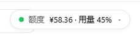
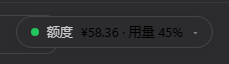
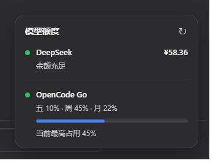

# dsh-quota-panel

English | [中文](README.zh.md)

**dsh-quota-panel** is a **provider quota/balance status widget** plugin for the DeepSeek Harness (DSH) web surface.

Since v0.5 it is a **dual-face plugin** with a **built-in provider catalog and auto discovery**:

- **Host half** (`lib/index.js`): registers one loopback-only Connection RPC
  channel `/dsh-quota-panel` (endpoints `specs` / `fetch-all`). API keys are
  resolved through `ctx.credentials` server-side and **never reach the
  browser**; upstream quota endpoints are called host-side with
  `Authorization: Bearer <key>` (optionally routed through an HTTP proxy) and
  the upstream responses are **normalized into generic view models**
  (balance / usage / info) — upstream JSON details stay host-side like the
  keys, with per-row error capture.
- **Browser half** (`lib/client.js`, served at
  `/plugins/dsh-quota-panel/client.js` through the `dsh.client` manifest):
  registers the `shell.overlay` slot and renders the Harness-native widget
  in the bottom-right corner with React, in two sizes:

- **Collapsed (default)** — minimal capsule: one "independent status dot +
  value" pair per account (e.g. `● ¥58.36 · ● 45%`); only the account in
  trouble recolors its own dot. Click to expand.
- **Expanded** — full card: "模型额度" header (refresh **⚙ settings** /
  collapse buttons) + one structured row per provider (status dot, name,
  primary value, secondary info, progress bar for usage-kind providers).

Both sizes auto-refresh (paused while the page is hidden); the refresh
button spins and repeated clicks never fire concurrent requests.

## Built-in provider catalog (auto discovery)

The host half ships a catalog of well-known providers. Each entry names the
provider's standard credential references; **every provider whose key
resolves (`$DSH_HOME/.credentials.yaml` / `.env` / environment) appears on
the panel automatically** with zero config, and disappears when the key
does. Domestic providers connect directly; international ones can be routed
through a named proxy per row (see below).

| Provider | Credential refs probed | Endpoint | Row kind |
|---|---|---|---|
| DeepSeek | `DEEPSEEK_API_KEY` | `api.deepseek.com/user/balance` | ¥ balance |
| OpenRouter | `OPENROUTER_API_KEY` | `openrouter.ai/api/v1/credits` | $ balance (purchased − used) |
| SiliconFlow | `SILICONFLOW_API_KEY` | `api.siliconflow.cn/v1/user/info` | ¥ balance |
| Moonshot / Kimi | `MOONSHOT_API_KEY` | `api.moonshot.cn/v1/users/me/balance` | ¥ balance |
| MiniMax | `MINIMAX_API_KEY` | `api.minimaxi.com/v1/token_plan/remains` | ¥ balance |
| StepFun | `STEP_API_KEY` / `STEPFUN_API_KEY` | `api.stepfun.com/v1/accounts` | ¥ balance (hover: cash/voucher) |
| xAI | `XAI_API_KEY` | `api.x.ai/v1/billing/credits` | $ balance |
| Zhipu GLM | `ZHIPU_API_KEY` / `GLM_API_KEY` | `open.bigmodel.cn/api/monitor/usage/quota/limit` | text row (quota remaining/total; no public balance API) |
| OpenCode Go | `OPENCODE_GO_API_KEY` | `opencode.ai/zen/go/v1/usage` | three-window usage % |

An additional **`openai-billing`** format adapts one-api / new-api style
aggregators: set `endpoint` to the aggregator base URL and the host half
requests `{base}/v1/dashboard/billing/subscription` (`hard_limit_usd`) plus
`{base}/v1/dashboard/billing/usage` (`total_usage`); remaining =
limit − used ($). Aggregator domains differ per deployment, so this format
is explicit-config only.

**Providers without a public balance/remaining endpoint** (OpenAI,
Anthropic, Together, Groq, Mistral, Cohere, DashScope, Baichuan) are not
supported yet — see "TODO" below.

## Settings panel (⚙)

Open the expanded card and click the gear next to the refresh button for
three groups of local settings (applied immediately, persisted to browser
localStorage, never written to the profile or uploaded):

- **显示供应商** — per-provider visibility checkboxes (hide all and the
  capsule shows "已全部隐藏"; settings stay reachable);
- **刷新间隔** — follow config (default) or a fixed 15s–5min interval;
- **预警阈值** — per-provider overrides: "warn ¥/$" for balance rows
  (critical derived as value/2) and "warn %" for usage rows (error derived
  as max(config, warn+1)); text rows have no threshold; empty restores the
  config default;
- **代理** — per-provider HTTP(S) proxy URL (e.g. `http://127.0.0.1:7890`);
  only that provider is queried through it; empty falls back to the profile
  config (if any) or a direct connection;
- **恢复默认** — clear all local settings at once.

Usage percentages in the capsule use **battery-style three-color** grading:
healthy green, tight amber, critical red, independent of the status dots;
balance values recolor only when their own status alarms.

The widget is driven entirely by Harness design tokens
(`--dsw-alias-*`, `--dsw-static-*`, `--dsw-shadow-*`, `--dsw-font-*`) with
sensible fallbacks, so it follows the product theme (light/dark) and ships
no palette of its own.

> The screenshots below were taken at v0.3 (before the ⚙ entry); the
> capsule/card bodies are unchanged.

## Screenshots

Collapsed capsule (light / dark):




Expanded card (light / dark):




Full page (collapsed capsule, light / dark):


## Install

```sh
# Track main (each install resolves to the latest commit)
dsh plugin --profile web add "github:wenzetan/dsh-quota-panel"
# Or pin the auto-tagged release (see .github/workflows/tag-release.yml)
dsh plugin --profile web add "github:wenzetan/dsh-quota-panel#v0.5.0"
# Restart `dsh web` (bundle layer and client module graph apply at boot)
```

Refresh the browser page once after installing. Zero npm dependencies (the
schema library — schemastery + cosmokit, both MIT — is vendored under
`lib/vendor/` with relative-path imports), no `allowBuilds` authorization
needed.

The package declares `dsh.bundle.patch` (host half auto-activates as a
profile layer) and the `dsh.client` manifest (browser half auto-joins the
`__DSH_BOOT__` module graph, `immediately: true` prefetched with the shell).

## Configuration

Structure and defaults live in the exported **`Config` schema** (vendored
schemastery), so profile patches may omit every defaulted field;
cross-field constraints (id uniqueness, `critical <= warn <= healthy`,
proxy references, catalog override keys) are validated host-side at mount
and fail loud.

| Key | Meaning | Default |
|---|---|---|
| `auto` | probe the built-in catalog; providers with a resolvable key join the panel | `true` |
| `hide` | row ids to drop (catalog and explicit rows alike) | `[]` |
| `proxies` | named proxy definitions `{<name>: "http://host:port"}`, HTTP(S) only | `{}` |
| `catalog` | partial overrides for auto-discovered rows `{<catalog-id>: {...}}` | `{}` |
| `refreshMs` | auto-refresh interval | 60000 |
| `providers` | explicit rows; a same-id entry replaces the catalog row wholesale | `[]` |

Each `catalog` override may set: `label` / `endpoint` / `format` / `proxy` /
`refs` (credential references to probe, UPPER_SNAKE) / `balanceTiers` /
`warnPercent` / `errorPercent` / `windowLabels`.

Explicit `providers` entries:

| Field | Meaning | Default |
|---|---|---|
| `id` | row key (RPC rows are keyed by id), `^[a-z0-9-]+$` | required |
| `label` | provider name on the card | required |
| `credential` | credential reference (`$DSH_HOME/.credentials.yaml` or env) | required |
| `endpoint` | quota JSON endpoint; the aggregator base URL for `openai-billing` | required |
| `format` | row adapter (see table below) | `deepseek-balance` |
| `proxy` | name defined in `proxies`; omit for direct connection | — |
| `balanceTiers` | (balance kinds) `{critical, warn, healthy}` | `{10, 20, 50}` |
| `lowBalance` | legacy alias for `balanceTiers.warn` | — |
| `windowLabels` | (opencode-usage) labels for the three windows | `{滚, 周, 月}` |
| `warnPercent` / `errorPercent` | (usage kinds) thresholds | 70 / 90 |

Built-in formats (they fix the row kind and currency):

| format | row kind | upstream response |
|---|---|---|
| `deepseek-balance` | ¥ balance | `{ balance_infos: [{ currency, total_balance, granted_balance, topped_up_balance }] }` |
| `openrouter-credits` | $ balance | `{ data: { total_credits, total_usage } }` |
| `siliconflow-balance` | ¥ balance | `{ data: { balance, chargeBalance, totalUsage } }` |
| `moonshot-balance` | ¥ balance | `{ data: { total_balance } }` |
| `minimax-remains` | ¥ balance | `{ data: { remain } }` |
| `stepfun-accounts` | ¥ balance | `{ balance, total_cash_balance, total_voucher_balance }` |
| `xai-credits` | $ balance | `{ total: { val } }` (cents → units) |
| `openai-billing` | $ balance | aggregator `dashboard/billing` pair |
| `zhipu-quota` | text | `{ code: 200, data: { limits: [{ remaining, number }] } }` |
| `opencode-usage` | usage % | `{ usage: { rolling\|weekly\|monthly: { percent, resetsAt } } }` |

### Proxy (for providers unreachable directly)

Proxies are configured in the **frontend settings panel (⚙ → 代理)**: one
HTTP(S) proxy URL per provider (e.g. `http://127.0.0.1:7890`, optionally
with `user:pass`), persisted to browser localStorage and applied
immediately — empty falls back to the profile config or a direct
connection. Requests still execute host-side: the browser sends each row's
proxy URL with the `fetch-all` payload, the host validates it (http/https
only, no socks) and routes the upstream request through it, and keys never
leave the host.

The profile-level `proxies` map plus per-row `proxy` / `catalog.<id>.proxy`
still works as the **default proxy** (used when the frontend leaves the row
empty); precedence: **frontend settings > profile config > direct**.

```yaml
# profile-level default proxy (the ⚙ panel overrides per row)
- id: quota-panel
  name: 'dsh-quota-panel'
  config:
    proxies:
      home: http://127.0.0.1:7890     # local clash / v2rayN http port
    catalog:
      openrouter:
        proxy: home                    # OpenRouter defaults to the proxy (frontend may override)
    providers:
      - id: my-agg
        label: 我的聚合站
        credential: AGG_API_KEY
        endpoint: https://agg.example  # openai-billing takes a base URL
        format: openai-billing
        proxy: home
```

The engine is hand-rolled with zero dependencies: https targets go through
an HTTP `CONNECT` tunnel (TLS over the tunnel socket), http targets through
absolute-URI forwarding; each row gets its own 15s timeout and error
capture, and a proxy failure only marks that row (e.g. `proxy CONNECT
failed: HTTP 403` or `client proxy "…": must be http:// or https://`).
socks5 is not supported.

### DeepSeek balance tiers

Defaults `balanceTiers {critical: 10, warn: 20, healthy: 50}`:

| Balance | Status | Secondary |
|---|---|---|
| `<= 10` | error (red dot + red value) | 建议充值 |
| `10 < x <= 20` | warn (amber) | 余额紧张 |
| `20 < x <= 50` | ok | 余额正常 |
| `> 50` | ok | 余额充足 |

### OpenCode usage status

`high = max(rolling, weekly, monthly)`:

| Usage | Status |
|---|---|
| `< warnPercent` | ok (green dot, DeepSeek-blue bar) |
| `>= warnPercent` | warn (amber dot + bar) |
| `>= errorPercent` | error (red dot + bar) |

## Changelog

- **v0.5.0** — built-in provider catalog + auto discovery (credential-ref
  probing, 9 providers on the panel with zero config); 8 new format
  adapters (incl. `openai-billing` for one-api/new-api aggregators);
  `fetch-all` contract changed to host-normalized views (balance / usage /
  info), upstream JSON no longer crosses the wire; per-row HTTP(S) proxy
  (CONNECT tunnel / absolute URI, zero dependencies), **configured per
  provider in the ⚙ settings panel** (localStorage, wins over the profile's
  `proxies` / `proxy` config); new `auto` / `hide` / `proxies` / `catalog`
  config keys.
- **v0.4.0** — dual-face refactor: loopback Connection RPC channel
  (`specs` / `fetch-all`) + `Config` schema in the host half; browser half
  moved to the `dsh.client` manifest + `shell.overlay` slot (React); ⚙
  settings panel (provider visibility / refresh interval / warn thresholds,
  persisted to localStorage).
- **v0.3.0** — two sizes: collapsed minimal capsule (independent per-account
  status dots + battery-style values), click to expand the full card.
- **v0.2.0** — Harness-native card: design tokens, balance tiers, usage
  progress bars.
- **v0.1.0** — initial floating panel: server-side quota proxy + page badge.

## Security

- API keys are resolved only by the host half through `ctx.credentials`
  and used only for host-side requests to providers; the browser talks
  exclusively over the loopback RPC channel `/dsh-quota-panel`, and the
  `specs` endpoint ships render hints only (labels/kinds/thresholds) with
  no credential or endpoint; since v0.5 `fetch-all` ships normalized views
  only — raw upstream JSON stays host-side too.
- The card builds DOM exclusively with `createElement`/`textContent`;
  API values never touch `innerHTML`; technical errors (401, timeout,
  missing credential, refused proxy) surface only in `title` tooltips or
  inline row text, and one failing row never affects the others.

## TODO

- **Usage-only providers**: OpenAI / Anthropic / Together / Groq / Mistral /
  Cohere / DashScope / Baichuan expose no public "remaining balance"
  endpoint — only usage/cost queries (usually admin keys + time windows,
  "spent" semantics rather than "remaining"). Planned as a separate usage
  row kind (Anthropic Admin API and OpenAI usage API first) showing monthly
  spend instead of balance.
- socks5 proxy support (HTTP/HTTPS only today).

## Local development

```sh
# Zero dependencies, no npm install needed. To upgrade the vendored schema
# library, replace the two files under lib/vendor/ and rewrite the cosmokit
# import on line 1 of schemastery.mjs to "./cosmokit.js".
# Dual-face check: host RPC contract + catalog discovery/proxy engine
# (exercised against real local servers) + client slot/settings surfaces
node scripts/test-page-script.mjs
```

## License

MIT
