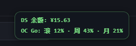
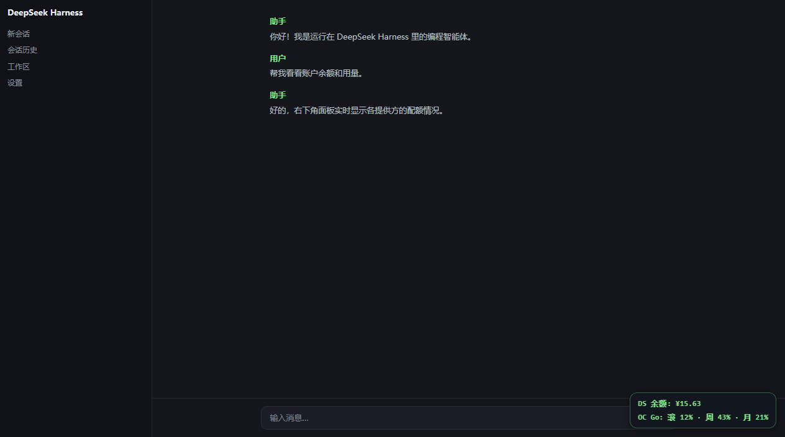

# dsh-quota-panel

[English](README.md) | 中文

**dsh-quota-panel** 是 DeepSeek Harness（DSH）网页端的**提供方额度/余额角标面板**插件。

一个零依赖的宿主端插件：为每个配置的提供方注册一条服务端代理路由
`/api/quota/<id>` —— API Key 通过凭据系统解析，**绝不进入浏览器** —— 然后在
页面注入右下角小面板，拉取路由数据并逐行渲染。数据每 60 秒自动刷新，点击面板
立即刷新；悬停可见明细（窗口、重置倒计时、赠送/充值余额），颜色提示低余额或
高用量。

## 效果图



完整页面效果（右下角）：



## 安装

```sh
dsh plugin --profile web add "github:brittanistrehlowll-oss/dsh-quota-panel"
# 重启 `dsh web`（bundle 层在启动时生效）
```

包声明了 `dsh.bundle.patch`，因此 `dsh plugin add` 会把它自动激活为 profile 层。

## 配置

每个提供方是 `providers` 下的一项，内置两种渲染器：

| format | 接口返回形态 | 行显示 |
|---|---|---|
| `deepseek-balance` | `{ "balance_infos": [{ "currency", "total_balance", "granted_balance", "topped_up_balance" }] }` | `¥15.63`，低于 `lowBalance` 变黄 |
| `opencode-usage` | `{ "usage": { "rolling"\|"weekly"\|"monthly": { "percent", "resetsAt" } } }` | `滚 4% · 周 43% · 月 21%`，达 `warnPercent` 变黄、`errorPercent` 变红 |

在 profile 的 `cordis.patch.yml` 中覆盖默认配置：

```yaml
- id: quota-panel
  config:
    refreshMs: 30000
    providers:
      - id: deepseek
        label: DS 余额
        credential: DEEPSEEK_API_KEY
        endpoint: https://api.deepseek.com/user/balance
        format: deepseek-balance
        lowBalance: 5
      - id: opencode-go
        label: OC Go
        credential: OPENCODE_GO_API_KEY
        endpoint: https://opencode.ai/zen/go/v1/usage
        format: opencode-usage
        windowLabels: { rolling: 五, weekly: 周, monthly: 月 }
        warnPercent: 70
        errorPercent: 90
```

字段说明：

| 字段 | 含义 | 默认值 |
|---|---|---|
| `id` | 路由 id（`/api/quota/<id>`），`^[a-z0-9-]+$` | 必填 |
| `label` | 行标签 | 必填 |
| `credential` | 凭据引用（`$DSH_HOME/.credentials.yaml` 或环境变量） | 必填 |
| `endpoint` | 额度 JSON 接口，GET + `Authorization: Bearer <key>` | 必填 |
| `format` | 行渲染器 | `deepseek-balance` |
| `windowLabels` | （opencode-usage）三个窗口的标签 | `{滚, 周, 月}` |
| `warnPercent` / `errorPercent` | （opencode-usage）颜色阈值 | 70 / 90 |
| `lowBalance` | （deepseek-balance）低于此总额变黄 | 5 |
| `refreshMs` | 面板自动刷新间隔 | 60000 |

## 安全

- API Key 仅由服务端通过 `ctx.credentials` 解析，只用于服务端到提供方的请求；
  浏览器只访问 `/api/quota/<id>`。
- 注入的面板脚本不含任何密钥，不注入 HTML（纯文本节点），行数据经同一 JSON
  转义路径处理。

## 本地开发

```sh
# 生成/刷新演示页 docs/demo.html（内含模拟数据）
node scripts/gen-demo.mjs
# 无头截图（通过 Chrome DevTools Protocol）
node scripts/shoot.mjs
```

## License

MIT
